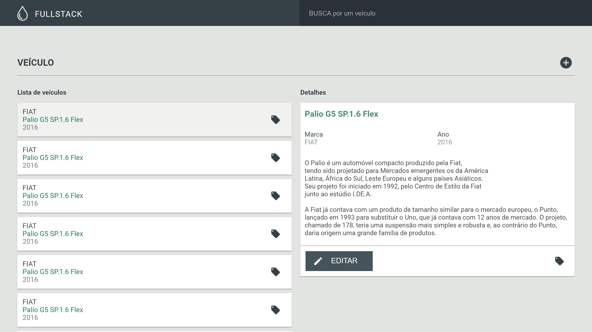
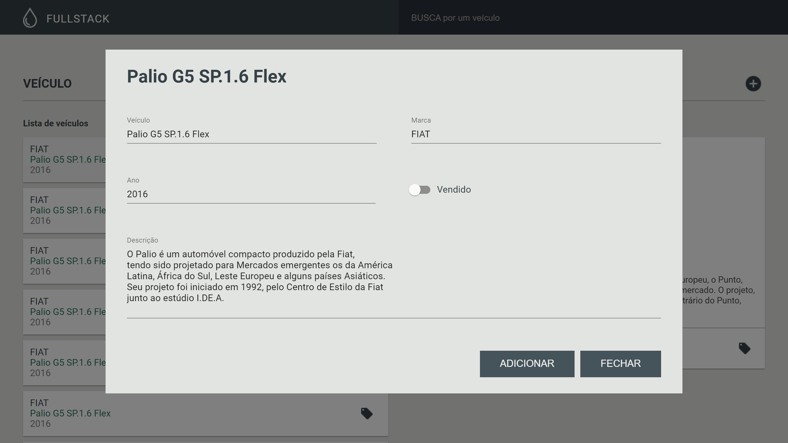

# Projeto

O **backend** foi feito com TypeScript, Express, TypeORM com MySQL. Jest e Supertest foram usados para os testes unitários, de integração e end-to-end.

### Rotas:

- **GET** /veiculos
- **GET** /veiculos/find?query=
- **POST** /veiculos
- **PUT** /veiculos/:id

O **frontend** foi feito com Next.js, TypeScript, Context API, styled-components e Material IU. A ideia foi reproduzir de maneira fiel o layout proposto.

# Como rodar o projeto

## Opção 1 (Docker) - Recomendado

Você vai precisar ter o [Docker](https://docs.docker.com/get-docker/) e o [docker-compose](https://docs.docker.com/compose/install/) instalados.

na raiz do repositório, execute:

```bash
$ docker-compose up
```

Aguarde a inicialização do mysql, backend e frontend. Esse comando pode demorar alguns minutos caso você nunca tenha usado as imagens.

## Opção 2

Você vai precisar ter o [Node](https://nodejs.org/en/) e o [Yarn](https://yarnpkg.com/getting-started/install) instalados. Você também vai precisar de um banco **MySQL** rodando.

1\. Entre na pasta `backend` e altere as informações do arquivo `.env.dev` conforme necessário:

Exemplo:

```
DB_TYPE=mysql
DB_HOST=localhost
DB_DATABASE=4events
DB_USER=admin
DB_PASSWORD=admin
```

2\. Ainda na pasta `backend`, execute-o:

```bash
$ yarn dev
```

3\. Entre na pasta `frontend` e altere as informações do arquivo `.env.local` conforme necessário:

Exemplo:

```bash
# API_URL que será usada pelo lado do browser (client)
NEXT_PUBLIC_API_URL=http://localhost:3333
# API_URL que será usada pelo lado do node (servidor)
API_URL=http://backend:3333
```

> Obs: Se você não estiver usando **docker-compose**, defina as duas variáveis acima com o mesmo valor.

4\. Ainda na pasta `frontend`, execute o app:

```bash
$ yarn dev
```

---

## Rodando os testes do backend

1\. Entre na pasta `backend` e execute:

```bash
$ yarn test
```

# Demo

<p align="center">
  
</p>

<p align="center">
  
</p>

# Teste fullstack

Leia primeiro todo o projeto, faça sua estimativa de horas para o desenvolvimento e envie um email com o título `[Teste Fullstack] Estimativa` para rh@4.events

Forke este projeto, faça o desenvolvimento e quando finalizar faça um PR aqui. Envie um email com o título `[Teste Fullstack] Finalizado` para rh@4.events com o link do seu PR.

Se você não sabe o que é fazer um "Forke" ou um "PR", pesquise. Valorizamos muito a proatividade.

**Lembre-se: atualize este README informando como instalar e executar seu projeto.**

## Missão backend

Desenvolver uma **API JSON RESTful** em **Node**, que utilize os métodos `GET` e `POST`.

Faça o teste unitário da **API** (Bônus :star:)

### Especificação

Monte uma base de veículo com a seguinte estrutura:

```
veiculo:   string
ano:       integer
descricao: text
vendido:   bool
created:   datetime
```

Utilize **MongoDB** ou **MySQL** para armazenar os dados que a **API** irá consumir.

### API endpoints

`GET /veiculos`

Retorna todos os veículos

---

`GET /veiculos/find`

Retorna os veículos de acordo com o termo passado parâmetro `q`

---

`POST /veiculos`

Adiciona um novo veículo

## Missão frontend

Desenvolver uma **UI (User Interface)** de acordo com o desenho que está na pasta [layout]

### Especificação

- Cross browser support (IE11+)
- Consumir **API** criada acima
- Criar uma tela que tenha...
  - Listagem de veículos
  - Busca
  - Formulário de novo veículo

### Dica

Tente pensar um pouco fora da caixa;

Utilizar Context API ou Redux será um diferencial;

Utilize algum framework para auxiliar no desenvolvimento da interface, por exemplo:

- https://getmdl.io/
- http://getbootstrap.com/css/
- http://foundation.zurb.com/

## Dúvida

Se tiver qualquer dúvida sobre esse teste, envie um email com o título `[Teste Fullstack] O assunto que vc deseja` para rh@4.events
